# Roadmaps - Using Now, Next, Later Roadmaps

We've provided a link at the bottom of this article to a PDF version of a presentation deck which also covers this topic.

## Outcome and Horizon-Based Roadmaps

Horizon-based Roadmaps are an essential tool in helping us prioritize customer outcomes without committing to timelines or solutions.

Observations from the State of Tech (SOT) highlighted issues the teams are facing with our current approach as it not only obscures the connection to our mission but also leaves our team members struggling to see how their work contributes to the organsations broader strategy.

By adopting outcome and horizon-based roadmaps, we create a communication tool that can work outside our teams and domains, without prior context and agnostic of our organizational structure. It allows our priorities to be aligned across all domains at both the Leadership Team (LT) and Senior Leadership Team (SLT) levels, fostering a shared understanding and improved collaboration.

By grounding our work in a comprehensive understanding of the problem, we can ensure that our solutions are not only meeting the customer need but also directly align with the organisations strategic goals.

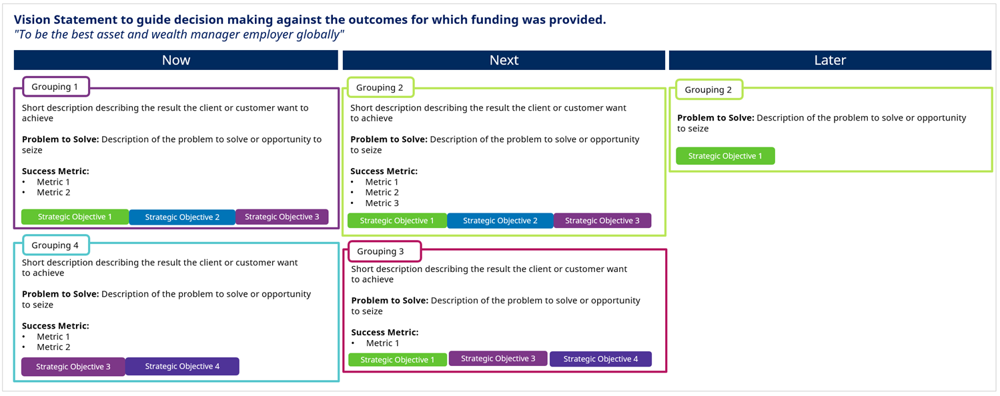

*[For a larger version right click on the image and 'Open image in a new tab']*

Our work is structured into three focus horizons, addressing immediate to long-term outcomes. This approach encourages flexibility, collaboration, and adaptability, allowing us to respond effectively to emerging needs.

The roadmap, a living document, communicates our strategy and outlines our collective approach to achieving our vision. It's a dynamic tool, evolving to reflect changes in our strategies and circumstances.

Achieving an outcome on a roadmap is a collective effort, with numerous teams and individuals contributing. We must remember that our roadmap operates within a broader context, and remain cognizant that the priority for a domain might not be the overall priority. This understanding should inform our feasibility assessments in each horizon, ensuring alignment with the broader organizational goals.

## Where Do Roadmaps Fit In?

In the image below, you can see that everything aligns to the Vision, which is set at the highest level. From this, our high-level strategy is crafted.

The high-level strategy is broken down into focus areas. A key tool in articulating and communicating the strategy in each area and making it actionable is the roadmap.

On the roadmap, you will see a vision statement, strategic objectives (which break down the strategy into very high level objectives) and outcomes that are aligned to one or more of the strategic objectives. The outcomes are placed into the appropriate horizon.

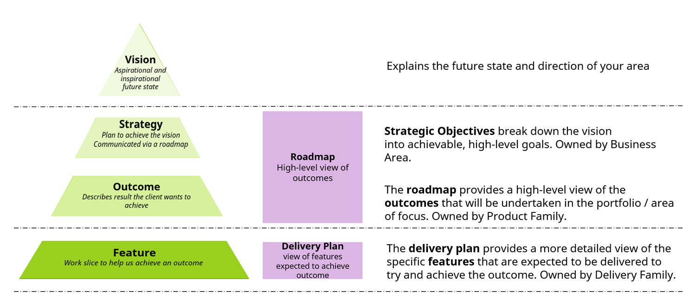

*[For a larger version right click on the image and 'Open image in a new tab']*

- **Vision** - Explains the future state and direction of your area.

- **Strategic Objectives** - Break down the vision into achievable, high-level goals. Owned by Business Area.

- The **roadmap** provides a high-level view of the **outcomes** that will be undertaken in the portfolio/area of focus. Owned by Product Family.

- The **delivery plan** provides a more detailed view of the specific **features** that are expected to be delivered to try and achieve the outcome. Owned by Delivery Family.

## Our Roadmaps Consist of Outcomes

We are using outcomes on our roadmaps because we want to focus on addressing the problems our customers face, rather than jumping straight to solutions. This strategy not only fosters greater collaboration in devising solutions but also imbues our delivery process with enhanced flexibility.

By focusing on outcomes, we allow for solution optionality and ensure that our solutions are adaptable, customer-centric, and effective in meeting the evolving needs of our customers.

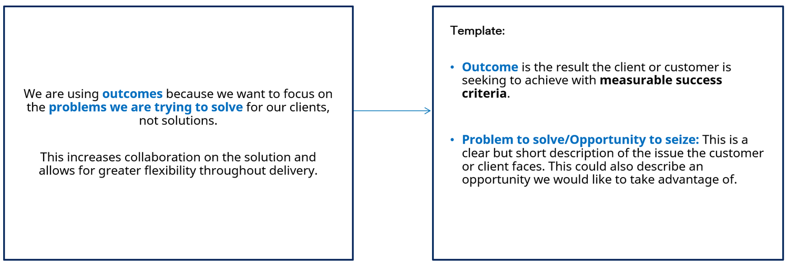

*[For a larger version right click on the image and 'Open image in a new tab']*

### Writing Outcomes - Template

**Outcome** is the result the customer is seeking to achieve with measurable success criteria.

**Problem to solve**: This is a clear but short description of the issue the customer faces. This could also describe an opportunity we would like to take advantage of.

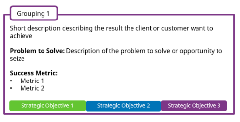

### Advice on Writing Outcomes

When crafting outcomes, begin by thoroughly understanding the problem that needs to be addressed. Engage in in-depth discussions and consider using techniques like the '5 Whys' to unearth the core issue. Once you've comprehended the problem, consider employing inverse thinking to define the desired outcome.

Avoid any elements that even remotely resemble a solution - the focus should be on the problem and the outcome, not on the means to achieve it. Try to articulate the problem and outcome without referencing specific system names, product names, or 'outputs'. If the work to be done can be inferred from the roadmap outcome, it might be overly solution-driven.

Be wary of language that implies activity such as 'conduct', 'create', etc., as this could indicate a feature masquerading as an outcome.

Lastly, ensure your success metrics are outcome-focused and not solution-based. They should measure the success of the outcome, not the solution.

### Do Change and BAU Outcomes Belong on the Roadmap?

Yes, both Change outcomes and Business As Usual (BAU) outcomes belong on a roadmap as they represent different types of work that require management and prioritization. However, the roadmap is predominantly a method for communicating outcomes that have strategic significance or transformative potential. As such, you can expect to see a higher proportion of Change outcomes than BAU outcomes on the roadmap.

#### Change Outcome

A change outcome is a result that is achieved through a specific change initiative or project. It is typically a new or improved capability that did not exist before the change was implemented. Change outcomes are often associated with strategic objectives and are intended to drive business growth or improve operational efficiency.

#### Business As Usual Outcome

A BAU outcome is a result that is achieved through ongoing operations and maintenance of existing systems and processes. BAU outcomes are typically focused on maintaining current capabilities and ensuring that business operations continue to run smoothly.

### Roadmap Template

The templates provide a detailed view of the outcomes you are aiming to achieve.

Each outcome must include the '**Result to achieve for Customer**', the '**Problem to Solve**', and the '**Success Criteria**' that will you will use to evaluate the success of the outcome.

Depending on the audience or communication channel it may be beneficial to display the roadmap in a simpler format. This would include the headline information only i.e., the 'Result to achieve for Customer' and the linked Strategic Objective and/or grouping.

*The decision of which style to use will depend on the best way to communicate this information to your stakeholders.*

### What it Should Look Like

*[For a larger version right click on the image and 'Open image in a new tab']*

### An Alternative View of Your Roadmap

For audiences where only headline detail is necessary

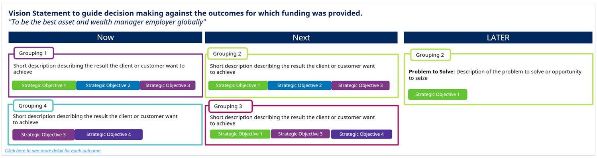

*[For a larger version right click on the image and 'Open image in a new tab']*

*When using this format it is important that the underlying details (the 'Problem to Solve', and the 'Success Criteria') are readily available*

## Aligning Your Outcomes

Aligning your outcomes with strategic objectives and organizing outcomes into high-level categories can help stakeholders better understand your strategy.

**Strategic Objective**: Outcomes should be aligned to at least one strategic objective. This will help ensure that outcomes are aligned to the strategy and can therefore help with prioritization decisions.

**Grouping**: Outcomes can be grouped into high-level categories on the roadmap. This helps stakeholders have better understanding of the work that is being done and how it fits into the overall plan.

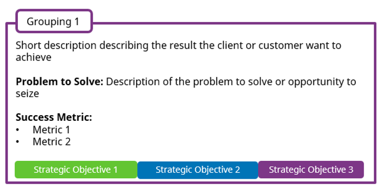

*[For a larger version right click on the image and 'Open image in a new tab']*

## The Process

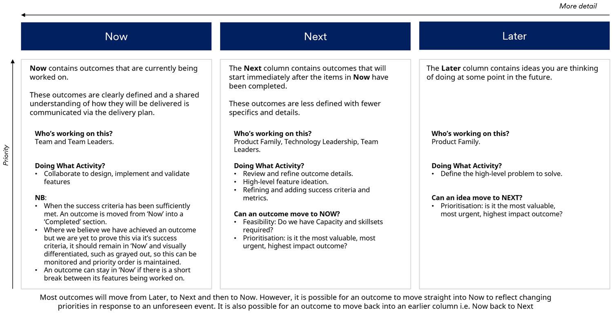

*[For a larger version right click on the image and 'Open image in a new tab']*

### Now

The 'Now' section encompasses outcomes currently in progress. These outcomes are precisely defined, and a mutual understanding of their delivery process is conveyed through the delivery plan.

The teams and their leaders are actively engaged in designing, implementing, and validating features.

It's important to note that an outcome is transitioned from 'Now' to the 'Completed' section when its success criteria have been adequately fulfilled. If we presume an outcome has been achieved but its success criteria have not yet been verified, it should remain in 'Now'. Such outcomes can be visually differentiated, perhaps by graying them out, to ensure they are monitored and the priority order is upheld.

An outcome can remain in the 'Now' section even if there's a brief pause in the work on its features.

### Next

The Next column contains outcomes that will start immediately after the items in Now have been completed. These outcomes are less defined with fewer specifics and details.

The Product Family, Technology Leadership, and Team Leaders should be working on these outcomes.

Their activities involve reviewing and refining outcome details, engaging in high-level feature ideation, and refining and adding success criteria and metrics.

Before an outcome can transition to 'Now', two key questions need to be addressed:

1. **Feasibility**: Do we possess the required capacity and skillsets?

2. **Prioritization**: Is it the most valuable, most urgent, and highest impact outcome?

These factors ensure that the right outcomes are worked on at the right time.

### Later

The Later column contains ideas you are thinking of doing at some point in the future.

The Product Family is responsible for capturing and prioritizing the high-level problem to solve.

Before an idea can transition to 'Next', it must be assessed for prioritization: is it the most valuable, most urgent, and highest impact outcome?

Typically, most outcomes progress from 'Later' to 'Next', and then to 'Now'. However, due to changing priorities or unforeseen events, an outcome might move directly into 'Now'. There's also the possibility of an outcome reverting to an earlier column, such as 'Now' back to 'Next', to accommodate shifts in focus.

### Relationship to Delivery Plans

Against each **outcome** on the roadmap, a set of features can be defined that deliver slices of value against that outcome.

The **features describe the work** we think is needed to solve the problem defined in the outcome.

Features are mapped onto a delivery plan aligned to the outcome and can be used to manage expectations of when delivery starts and how long it might take.

Delivery plans can be illustrated by team and by outcome as shown here, or by a group of teams aligned to outcomes.

Delivery plans are increasingly less accurate the further into the future they project.

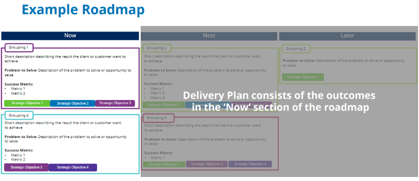 

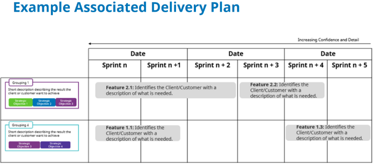

*[For a larger version right click on the image and 'Open image in a new tab']*

*More detail on Delivery Plans can be found in the Delivery Plan guidance \[Coming Soon\]. Please speak to an Enterprise Delivery Lead if you need any assistance.*

## Tracking the Outcome Success Criteria

There are two parts to this:

- **Live Outcome View per Capability/Product**

- **Achieved Outcomes**

### Live Outcome View per Capability/Product

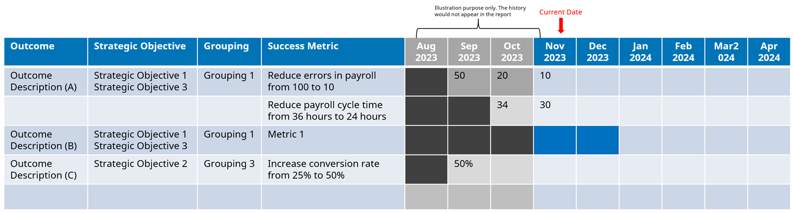

*[For a larger version right click on the image and 'Open image in a new tab']*

This image describes how you might track a rolling six-month view of live outcomes. These are outcomes that are in the **NOW** section of your roadmap.

We track the success of an outcome through its success criteria. Here we use colored blocks to indicate when we expect the success metric of an outcome to start being impacted. For example, on outcome A we expect the success metric "Reduce errors in payroll from 100 to 10" to start to be impacted from September 2023. Whereas on outcome B we expect the success metric 1 to be impacted from January 2024.

This view provides early visibility into the effectiveness of the features on the outcome, enabling us to make informed decisions on pivoting, stopping, and/or identifying learning opportunities for subsequent features.

### Achieved Outcomes

Below you'll see a list of achieved outcomes that reminds us of the problems we have solved and opportunities we have seized for our customers. It is also an opportunity to provide commentary on what we have learned so we can take that forward and improve further.

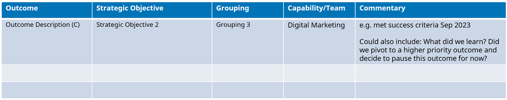

*[For a larger version right click on the image and 'Open image in a new tab']*

## Appendix

### Definitions

| **Term** | **Definition** |

|---------------------------|----------------------------------------------------------------------------------------------------------------------------------------------------------------------------------------------------------------------------------------------------------------------------------------------|

| **Feature** | A feature represents a slice of value and is expected to contribute to the achievement of an outcome. A feature should be small enough that it can be delivered within four to six weeks. This is so that we can respond quickly to changing priorities whilst also minimizing waste. A feature will be broken down by the team to work on. |

| **Goal** | A goal is specific, measurable, and time-bound. It describes what an individual or organization aims to achieve. |

| **Outcome** | An outcome is the result the customer is seeking to achieve. It focuses on the problem we are trying to solve for our customers, not the solution. |

| **Product** | A product is a physical or digital item or service, crafted to meet specific user needs. |

| **Product Family** | Refers to those who are responsible for setting a product vision and defining a product strategy. |

| **Roadmap** | A roadmap is a visual document that communicates the steps you plan to take to meet your vision over time. |

| **Roadmap Grouping** | Outcomes can be grouped into high-level categories on the roadmap. Groupings help your roadmap tell a compelling story about the direction you want to go in. |

| **Strategy** | A strategy is a plan of action designed to achieve a long-term or overall goal i.e., the vision. |

| **Strategic Objective** | Strategic Objectives break down the vision into achievable, high-level goals. |

| **Vision** | A vision statement outlines the company's long-term goals and aspirations for the future in terms of its long-term growth and impact on the world. |